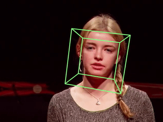

# Head pose estimation

This repo shows how to estimate human head pose from videos using TensorFlow and OpenCV.




## Getting Started

The following packages are required:

- TensorFlow 1.14.
- OpenCV 3.3 or higher.
- Python 3.5

The code is tested on Ubuntu 16.04.

## Installing

This repository comes with a pre-trained model for facial landmark detection. Just git clone then you are good to go.

```bash
# From your favorite development directory:
git clone https://github.com/yinguobing/head-pose-estimation.git
```

## Running

A video file or a webcam index should be assigned through arguments. If no source provided, the default webcam will be used.

### For video file

For any video format that OpenCV supported (`mp4`, `avi` etc.):

```bash
python3 estimate_head_pose.py --video /path/to/video.mp4
```

### For webcam

The webcam index should be assigned:

```bash
python3 estimate_head_pose.py --cam 0
``` 

## How it works

There are three major steps:

1. Face detection. A face detector is adopted to provide a face box containing a human face. Then the face box is expanded and transformed to a square to suit the needs of later steps.

2. Facial landmark detection. A custom trained facial landmark detector based on TensorFlow is responsible for output 68 facial landmarks.

3. Pose estimation. Once we got the 68 facial landmarks, a mutual PnP algorithms is adopted to calculate the pose.

The marks is detected frame by frame, which result in small variance between adjacent frames. This makes the pose unstable. A Kalman filter is used to solve this problem, you can draw the original pose to observe the difference.

## Retrain the model

To reproduce the facial landmark detection model, you can refer to this [series](https://yinguobing.com/deeplearning/) of posts(in Chinese only). And the training code is also open sourced: https://github.com/yinguobing/cnn-facial-landmark


## License
This project is licensed under the MIT License - see the [LICENSE.md](LICENSE.md) file for details

## Authors
Yin Guobing (尹国冰) - [yinguobing](https://yinguobing.com)


## Acknowledgments
The pre-trained TensorFlow model file is trained with various public data sets which have their own licenses. Please refer to them before using this code.

- 300-W: https://ibug.doc.ic.ac.uk/resources/300-W/
- 300-VW: https://ibug.doc.ic.ac.uk/resources/300-VW/
- LFPW: https://neerajkumar.org/databases/lfpw/
- HELEN: http://www.ifp.illinois.edu/~vuongle2/helen/
- AFW: https://www.ics.uci.edu/~xzhu/face/
- IBUG: https://ibug.doc.ic.ac.uk/resources/facial-point-annotations/

The 3D model of face comes from OpenFace, you can find the original file [here](https://github.com/TadasBaltrusaitis/OpenFace/blob/master/lib/local/LandmarkDetector/model/pdms/In-the-wild_aligned_PDM_68.txt).

The build in face detector comes from OpenCV. 
https://github.com/opencv/opencv/tree/master/samples/dnn/face_detector
